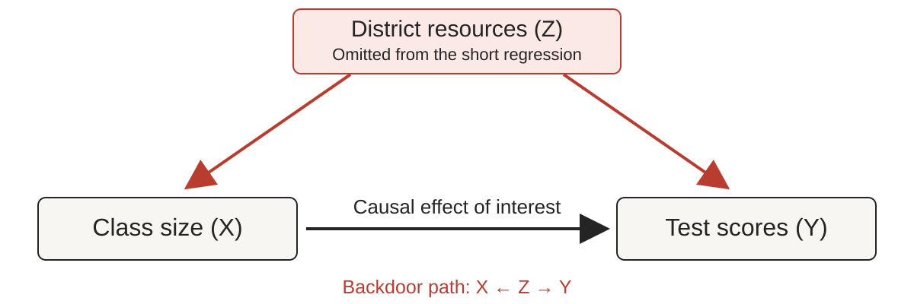

```{r}
#| label: setup
#| include: false

library(ggplot2)
theme_set(
  theme_minimal(base_size = 20) +
    theme(
      panel.grid.minor = element_blank(),
      plot.title = element_text(face = "bold", colour = "#242424"),
      plot.background = element_rect(fill = "transparent", colour = NA)
    )
)
```

## Statistics turns data into answers

::: {.key-idea}
**Statistics uses data to learn about unknown features of a population.**
:::

- What are the mean earnings of recent college graduates?
- Do mean earnings differ between men and women—and by how much?
- These questions concern the **population distribution of earnings**, not just the people we happen to observe.

::: {.notes}
Based on the opening of Stock and Watson, Chapter 3, supplied in the snapshot.
Define the population of interest before collecting data: for example, recent
college graduates working in a specified country and year. Specify the earnings
measure and reference period. A difference in group means is descriptive; by
itself, it does not identify the causal effect of gender or discrimination.
:::

## Why not survey everyone?

- A **census** aims to collect information from every member of the population.
- Measuring everyone's earnings would require substantial money, time, and coordination.
- Even a large survey can miss people or fail to obtain responses.
- A practical alternative is to study a **sample** drawn from the population.

::: {.notes}
The source illustrates the cost and logistical difficulty of full enumeration
using the 2010 U.S. census. Keep the teaching point general: attempting to
observe everyone is expensive and does not guarantee complete coverage.
:::

## A random sample can inform us about a population

::: {.definition}
**Statistical inference** uses sample data to draw conclusions about unknown population characteristics.
:::

- For example, select **1,000 people by simple random sampling** from the population of interest.
- Use their earnings to learn about the population mean and differences between groups.
- A different random sample would generally give a different answer: **sampling uncertainty** matters.
- The sampling design connects what we observe to the population we want to understand.

::: {.notes}
The sample size of 1,000 is illustrative, not a guarantee of precision or
representativeness. Under simple random sampling, each possible sample of the
specified size has the same chance of selection. Coverage and nonresponse still
matter. Statistical inference quantifies sampling uncertainty under stated
assumptions; it does not automatically correct a biased sample.
:::

## Three tools for learning from a sample

- **Estimation:** calculate a numerical estimate of an unknown population characteristic—for example, mean earnings.
- **Hypothesis testing:** assess sample evidence against a specific claim—for example, that two population means are equal.
- **Confidence intervals:** construct a range of plausible values for a population characteristic, reflecting sampling uncertainty.

::: {.key-idea}
We begin with all three tools for an **unknown population mean**.
:::

::: {.notes}
This is the roadmap for Chapter 3, Sections 3.1–3.3. A hypothesis test does not
prove a hypothesis true or false: failure to reject is not proof of the null.
A 95% confidence procedure covers the fixed population parameter in 95% of
repeated samples under its assumptions; it does not assign a 95% probability
to the fixed parameter lying in the particular realized interval.
:::

## Estimating a population mean {.section-slide background-color="#E85D4A"}

Section 3.1 · What makes an estimator good?

::: {.notes}
Source: Stock and Watson, Section 3.1, including Key Concepts 3.1–3.3.
The proofs, numerical examples, and exact normal-density plots below develop
the section's results. The bias–variance decomposition and correlated-sampling
formula are explicitly labeled extensions. No external earnings data are used.
:::

## Start with the quantity we want to learn

Let $Y$ be hourly earnings of a randomly selected worker in our target population.

$$
\mu_Y = E(Y), \qquad \sigma_Y^2 = E\big[(Y-\mu_Y)^2\big].
$$

- **Target:** the population mean $\mu_Y$, a fixed but unknown number.
- **Data:** a random sample $Y_1,\ldots,Y_n$.
- **Task:** use those observations to construct an estimate of $\mu_Y$.

::: {.notes}
Specify the population, earnings definition, country, and reference period in
an actual application. Here hourly earnings are an illustrative variable; no
empirical claims are made. The population variance measures heterogeneity
across workers, not uncertainty about an estimated mean.
:::

## Our working assumptions

$$
Y_1,\ldots,Y_n \text{ are i.i.d.}, \qquad
E(Y_i)=\mu_Y, \qquad 0<\operatorname{Var}(Y_i)=\sigma_Y^2<\infty.
$$

- **Identically distributed:** every observation comes from the same population distribution.
- **Independent:** knowing one observation does not change the distribution of another.
- **Finite variance:** squared deviations have a finite population average.
- These assumptions do **not** require a normal population distribution.

::: {.notes}
We use the textbook's i.i.d. framework. Strictly, sampling without replacement
from a finite population creates dependence; when the sampling fraction is
appreciable, finite-population corrections matter. Independence is stronger
than zero covariance, but zero covariances suffice for the variance calculations
below. Nonzero variance excludes the trivial case in which every Y is identical.
:::

## An estimator is a rule; an estimate is its result

::: {.definition}
An **estimator** is a function of random sample data. An **estimate** is the number obtained after observing one sample.
:::

$$
\underbrace{\bar Y=\frac{1}{n}\sum_{i=1}^n Y_i}_{\text{random before sampling}}
\qquad\longrightarrow\qquad
\underbrace{\bar y=\frac{12+16+20+32}{4}=20}_{\text{one realized estimate}}.
$$

- The population mean remains fixed across repeated samples.
- The estimator changes because the sampled workers change.

::: {.notes}
The four earnings values are invented, in currency units per hour. Lowercase
y denotes realized observations; uppercase Y denotes random variables. The
textbook sometimes uses the same notation for an estimator and its realization;
the distinction is conceptual even when typography does not change.
:::

## One target, several possible estimators

For an even sample size $n$, consider three rules:

| Rule | Estimator | How it uses the sample |
|---|---|---|
| Sample mean | $\bar Y=\frac{1}{n}\sum_iY_i$ | Equal weight on everyone |
| First observation | $Y_1$ | Uses only one person |
| Unequal weights | $\widetilde Y=\frac{1}{n}\sum_i a_iY_i$ | $a_i=\tfrac12$ for odd $i$; $\tfrac32$ for even $i$ |

For $(12,16,20,32)$, these give **20**, **12**, and **22**.

::: {.notes}
The alternating weights reproduce Equation 3.1. They are attached to observation
indices before seeing earnings, not assigned by ranking the observed values.
All three rules target the same population mean. A single realized sample cannot
tell us which rule is best over repeated samples, especially with mu unknown.
:::


## Unbiasedness: correct on average

$$
\operatorname{Bias}(\hat\mu_Y)=E(\hat\mu_Y)-\mu_Y.
$$

::: {.definition}
$\hat\mu_Y$ is **unbiased** if $E(\hat\mu_Y)=\mu_Y$.
:::

- The expectation is over repeated random samples.
- Positive and negative estimation errors cancel **on average**.
- An unbiased estimator can still be very inaccurate in a particular sample.

::: {.notes}
Bias is a property of the estimation rule and sampling process, not the
observed difference between one estimate and the truth. That realized
difference is estimation error. Unbiasedness alone says nothing about how
widely the estimates are dispersed.
:::

## Why the sample mean is unbiased

By linearity of expectation,

$$
\begin{aligned}
E(\bar Y)
&=E\left(\frac{1}{n}\sum_{i=1}^nY_i\right)\\
&=\frac{1}{n}\sum_{i=1}^nE(Y_i)
=\frac{n\mu_Y}{n}=\mu_Y.
\end{aligned}
$$

Each observation is centered at $\mu_Y$, so their average is too.

::: {.key-idea}
This proof needs a common mean and finite expectations; it does **not** use independence.
:::

## Why averaging reduces variance

$$
\begin{aligned}
\operatorname{Var}(\bar Y)
&=\frac{1}{n^2}\left[\sum_{i=1}^n\operatorname{Var}(Y_i)
+2\sum_{i<j}\operatorname{Cov}(Y_i,Y_j)\right]\\
&=\frac{1}{n^2}(n\sigma_Y^2+0)
=\frac{\sigma_Y^2}{n}.
\end{aligned}
$$

- Independence removes the covariance terms.
- Independent deviations partly cancel when we average them.
- The standard deviation is $\operatorname{SD}(\bar Y)=\sigma_Y/\sqrt n$.

::: {.notes}
The n-squared in the denominator comes from squaring the factor 1/n when
taking a variance. The n in the numerator counts n equal variance terms.
The population standard deviation sigma_Y does not shrink when we collect
more observations. It is the sampling standard deviation of the mean that
shrinks. Estimating this unknown standard deviation comes in Section 3.2.
:::

## Precision improves at the square-root rate

Suppose the population standard deviation of hourly earnings is $\sigma_Y=8$.

| Sample size $n$ | $\operatorname{Var}(\bar Y)=64/n$ | $\operatorname{SD}(\bar Y)=8/\sqrt n$ |
|---:|---:|---:|
| 4 | 16 | 4 |
| 16 | 4 | 2 |
| 64 | 1 | 1 |
| 256 | 0.25 | 0.5 |

::: {.key-idea}
To halve the sampling standard deviation, we need **four times** as many observations.
:::

::: {.notes}
These are exact calculations under the i.i.d. model with the hypothetical
sigma of 8; they are not estimated from an earnings dataset. Variance is in
squared earnings units; standard deviation is in earnings units. Sample size
alone does not determine precision: population variability matters too.
:::

## See the sampling distribution concentrate

```{r}
#| label: exact-mean-densities
#| echo: false
#| fig-width: 12
#| fig-height: 4.5
#| out.width: "90%"
#| fig-alt: "Exact normal densities of the sample mean for sample sizes 4, 16, and 64. All are centered at 20; larger samples produce narrower densities."

# Hypothetical normal population: mean 20, standard deviation 8.
# These are exact densities, not a simulation or observed earnings data.
mean_density <- expand.grid(mean_value = seq(4, 36, length.out = 801),
                            sample_size = c(4, 16, 64))
mean_density$density <- with(mean_density,
  dnorm(mean_value, mean = 20, sd = 8 / sqrt(sample_size)))
mean_density$sample_size <- factor(mean_density$sample_size)
ggplot(mean_density, aes(mean_value, density, colour = sample_size)) +
  geom_vline(xintercept = 20, colour = "#68645F", linetype = "dashed") +
  geom_line(linewidth = 1.3) +
  scale_colour_manual(values = c("#A59E94", "#242424", "#E85D4A"),
                      name = "Sample size") +
  labs(x = "Sample mean", y = "Density") +
  theme(legend.position = "top")
```

Illustration: $Y_i\sim N(20,64)$ independently, so $\bar Y\sim N(20,64/n)$ **exactly**.

::: {.notes}
Normality is imposed only to draw these exact illustrative curves. The
unbiasedness and variance formulas on the preceding slides do not require it.
Each curve has area one. A taller peak indicates concentration, not more
probability in total. These density calculations require no random seed.
:::

## Consistency: increasingly close with high probability

::: {.definition}
$\hat\mu_n$ is **consistent** for $\mu_Y$ if, for every $\varepsilon>0$,
$$
\Pr\big(|\hat\mu_n-\mu_Y|>\varepsilon\big)\longrightarrow0
\quad\text{as }n\longrightarrow\infty.
$$
:::

- Fix any positive error tolerance, such as one earnings unit.
- The probability of exceeding that tolerance must tend to zero.
- We write $\hat\mu_n\xrightarrow{p}\mu_Y$: **convergence in probability**.

::: {.notes}
Consistency concerns a sequence of estimators as sample size grows. It does
not say that every additional observation moves the realized estimate closer
to the truth, or that a finite sample has no error. The tolerance epsilon is
fixed before taking the limit; it can be arbitrarily small but positive.
:::

## Prove consistency of the sample mean

Chebyshev's inequality gives, for any $\varepsilon>0$,

$$
\Pr\big(|\bar Y-\mu_Y|>\varepsilon\big)
\leq \frac{E[(\bar Y-\mu_Y)^2]}{\varepsilon^2}
=\frac{\sigma_Y^2}{n\varepsilon^2}
\longrightarrow0.
$$

- Unbiasedness makes the mean squared error equal to the variance.
- The variance vanishes as $n$ increases.
- This proves a **law of large numbers** under our finite-variance assumptions.

::: {.notes}
Chebyshev gives an upper bound, not the exact probability. The bound can be
larger than one for small n and then is uninformative. The general i.i.d. law
of large numbers can hold with weaker moment assumptions; finite variance
is sufficient for this short proof and matches our working framework.
:::

## Unbiasedness and consistency are different

Assume the same i.i.d. population with $\sigma_Y^2>0$.

| Estimator sequence | Bias | Consistent? |
|---|---:|---|
| $\bar Y$ | $0$ | Yes: variance tends to zero |
| $Y_1$ for every $n$ | $0$ | No: its distribution never concentrates |
| $\bar Y+1/n$ | $1/n$ | Yes: the added bias vanishes |
| $\bar Y+2$ | $2$ | No: it converges to $\mu_Y+2$ |

::: {.key-idea}
An estimator can be unbiased but inconsistent—or biased at every finite $n$ yet consistent.
:::

::: {.notes}
The numerical shifts are in the units of Y. For Y_1, nondegeneracy implies
there is some positive epsilon for which the chance of being farther than
epsilon from mu is positive and unchanged as n grows. The biased examples
are pedagogical extensions that separate the definitions; they are not
recommendations for estimating earnings.
:::

## Efficiency: compare spread at the same sample size

For two **unbiased** estimators of the same parameter,

$$
\operatorname{Var}(\hat\mu_Y)<\operatorname{Var}(\widetilde\mu_Y)
\quad\Rightarrow\quad
\hat\mu_Y\text{ is more efficient}.
$$

- Both sampling distributions have the correct center.
- Lower variance means smaller **average squared estimation error**.
- It does not mean the more efficient rule wins in every realized sample.

::: {.notes}
Use the section's finite-sample comparison among unbiased estimators.
Variance does not fully order every possible probability of error or every
loss function. The exact average-squared-error interpretation follows from
unbiasedness and is more precise than saying an estimator is always closer.
:::

## Using the whole sample beats using one observation

$$
E(Y_1)=E(\bar Y)=\mu_Y,
\qquad
\operatorname{Var}(Y_1)=\sigma_Y^2,
\qquad
\operatorname{Var}(\bar Y)=\frac{\sigma_Y^2}{n}.
$$

- For $n>1$, the sample mean has **$1/n$ of the variance** of $Y_1$.
- $Y_1$ discards the information in the other $n-1$ observations.
- For $n=16$ and $\sigma_Y=8$, sampling SD falls from **8 to 2**.

::: {.key-idea}
Both estimators are unbiased. Only one becomes precise as the sample grows.
:::

## Unequal weights: still centered correctly

For even $n$, the textbook proposes

$$
\widetilde Y=\frac1n\left(\frac12Y_1+\frac32Y_2+\cdots+
\frac12Y_{n-1}+\frac32Y_n\right).
$$

There are $n/2$ observations of each weight, so

$$
E(\widetilde Y)=\frac{\mu_Y}{n}
\left(\frac n2\cdot\frac12+\frac n2\cdot\frac32\right)=\mu_Y.
$$

The actual weights on the observations sum to one: **no bias**.

## Unequal weights: a cost in precision

Under independence, variances add with **squared weights**:

$$
\begin{aligned}
\operatorname{Var}(\widetilde Y)
&=\frac{\sigma_Y^2}{n^2}
\left[\frac n2\left(\frac12\right)^2+
\frac n2\left(\frac32\right)^2\right]\\
&=\frac{5\sigma_Y^2}{4n}
=1.25\operatorname{Var}(\bar Y).
\end{aligned}
$$

- It is consistent: its bias is zero and variance tends to zero.
- But it has **25% more variance** at each fixed $n$.
- Unequal influence wastes precision when observations are equally informative.

::: {.notes}
Its sampling standard deviation is sqrt(1.25), about 1.118, times that of
the sample mean: about 11.8% larger, not 25% larger. It needs about 25% more
observations to match the variance of the equally weighted mean, subject to
the even-sample-size restriction.
:::

## BLUE: make the comparison class explicit

Consider any estimator with **fixed, nonrandom weights**:

$$
\hat\mu_Y=\sum_{i=1}^n w_iY_i.
$$

- **Linear:** a weighted sum of the observations.
- **Unbiased:** $\sum_iw_i=1$, ensuring $E(\hat\mu_Y)=\mu_Y$ for every $\mu_Y$.
- **Best:** smallest variance within this class of estimators.

::: {.key-idea}
Under our assumptions, $w_i=1/n$ is optimal: the sample mean is **BLUE**.
:::

::: {.notes}
BLUE means Best Linear Unbiased Estimator. Our w_i equals a_i/n in the
textbook's notation. Weights may be negative; the proof still applies.
They cannot depend on observed outcomes for this fixed-weight proof.
Requiring unbiasedness for every possible mean rules out choosing weights
that happen to work only at a particular parameter value, such as zero.
:::

## Prove BLUE by measuring unequal weights

If $\sum_iw_i=1$, then

$$
\sum_{i=1}^n\left(w_i-\frac1n\right)^2
=\sum_{i=1}^nw_i^2-\frac1n\geq0.
$$

Consequently,

$$
\operatorname{Var}(\hat\mu_Y)
=\sigma_Y^2\sum_iw_i^2
=\underbrace{\frac{\sigma_Y^2}{n}}_{\operatorname{Var}(\bar Y)}
+\underbrace{\sigma_Y^2\sum_i(w_i-1/n)^2}_{\text{penalty for unequal weights}}.
$$

Equality holds **only when every $w_i=1/n$**.

::: {.notes}
Expand the first sum: sum w_i squared minus (2/n) sum w_i plus n/n squared.
Using sum w_i = 1 leaves sum w_i squared minus 1/n. The second identity
uses zero covariances and a common variance. This elementary proof develops
the section's BLUE statement without waiting for the regression proof later
in the book. Positive population variance makes equality unique.
:::

## What “best” does—and does not—claim

- BLUE compares **linear, unbiased** estimators under the stated sampling assumptions.
- It does not rank all nonlinear or biased estimation rules.
- If observations differ in precision, equal weighting need not be optimal.
- Survey weights may be needed to represent the target population correctly.

::: {.notes}
For independent observations sharing a mean but with different known
variances, inverse-variance weights minimize variance among linear unbiased
estimators. That is a different model from the common-variance setting here.
Survey weights address unequal inclusion probabilities; arbitrary alternating
weights in Equation 3.1 do not. Avoid extrapolating BLUE to every sampling design.
:::


## A second route to the mean: least squares

Suppose we must predict every observation using the same number $m$.

$$
\text{Prediction error for person }i:\quad Y_i-m.
$$

Choose $m$ to minimize the total squared prediction errors:

$$
\hat m=\underset{m}{\arg\min}\;Q(m),
\qquad Q(m)=\sum_{i=1}^n(Y_i-m)^2.
$$

Squaring prevents positive and negative errors from canceling and penalizes large errors more heavily.

::: {.notes}
This is Equation 3.2. Minimizing average squared error Q(m)/n gives exactly
the same m. These are in-sample errors for a constant prediction. The
optimization is an algebraic statement about the realized observations;
interpreting the solution as a good estimate of a population mean also
requires a connection between the sample and that population.
:::

## Least squares: derive the solution with calculus

$$
\begin{aligned}
Q'(m)&=-2\sum_{i=1}^n(Y_i-m)
=-2\sum_{i=1}^nY_i+2nm,\\
Q'(\hat m)&=0
\quad\Rightarrow\quad
\hat m=\frac1n\sum_{i=1}^nY_i=\bar Y.
\end{aligned}
$$

$$
Q''(m)=2n>0.
$$

The objective is strictly convex, so $\bar Y$ is the **unique global minimum**.

::: {.notes}
Treat the observed Y_i as fixed when differentiating with respect to m.
The first-order condition says that the fitted residuals sum to zero.
The positive second derivative holds for every m and n greater than zero,
so the stationary point is the unique global minimum.
:::

## Least squares: an algebraic proof

Write $Y_i-m=(Y_i-\bar Y)+(\bar Y-m)$. Expanding gives

$$
\begin{aligned}
\sum_i(Y_i-m)^2
&=\sum_i(Y_i-\bar Y)^2
+2(\bar Y-m)\underbrace{\sum_i(Y_i-\bar Y)}_{0}\\
&\quad+n(\bar Y-m)^2.
\end{aligned}
$$

Thus $Q(m)=Q(\bar Y)+n(m-\bar Y)^2\geq Q(\bar Y)$.

::: {.key-idea}
Moving away from the sample mean adds a nonnegative penalty to squared error.
:::


## Section 3.1: the results and their assumptions

| Result | What supports it here |
|---|---|
| $E(\bar Y)=\mu_Y$ | Common mean and finite expectations |
| $\operatorname{Var}(\bar Y)=\sigma_Y^2/n$ | Common finite variance and zero covariances |
| $\bar Y\xrightarrow{p}\mu_Y$ | Our i.i.d., finite-variance framework |
| $\bar Y$ is BLUE | Fixed linear unbiased weights; common variance; zero covariances |
| $\bar Y$ minimizes $\sum_i(Y_i-m)^2$ | Algebra; no sampling assumption required |

Next: how much evidence does an estimate provide against a claim about $\mu_Y$?

::: {.notes}
These are sufficient conditions in our setting, not claims that no weaker
conditions are possible. Keep separate the algebra of fitting the observed
sample and the statistical assumptions that connect it to a population.
Section 3.2 will introduce hypothesis tests and estimation of the sampling
standard deviation; those topics are not developed in this section.
:::

## Testing a claim about the mean {.section-slide background-color="#E85D4A"}

Section 3.2 · How surprising are the data if the claim is true?

::: {.notes}
Source: Stock and Watson, Section 3.2, Key Concepts 3.4–3.6 and Equations
3.3–3.17. We develop the sample-variance proofs, standardization argument,
and testing logic. Power calculations and the multiple-testing example are
labeled extensions. The earnings example uses the textbook's hypothetical
summary statistics, not an external dataset. All plots are deterministic.
:::

## A sample mean is rarely exactly the claimed mean

Suppose someone claims that mean hourly earnings equal **20**.

- Our sample mean is **22.64**, a difference of **2.64**.
- Perhaps the population mean really is different from 20.
- Perhaps the population mean is 20 and random sampling produced the gap.

::: {.key-idea}
The question is whether **2.64 is large relative to sampling uncertainty**.
:::

::: {.notes}
Use currency units per hour throughout. This is the hypothetical example
from the book. Observing any nonzero gap cannot be sufficient for rejection:
under a continuous sampling distribution, exact equality has probability
zero even when the null is true.
:::

## State the hypotheses about the population

$$
H_0:\mu_Y=\mu_{Y,0}
\qquad\text{versus}\qquad
H_1:\mu_Y\neq\mu_{Y,0}.
$$

- $H_0$ is the **null hypothesis**, the claim used to calibrate the test.
- $H_1$ is the **two-sided alternative**: deviations in either direction matter.
- $\mu_{Y,0}$ is specified by the question; it is **20** in our example.
- The hypotheses concern $\mu_Y$, not the observed sample mean $\bar y$.

::: {.notes}
The null need not be something we personally believe. It is a benchmark
whose implications for sampling behavior we can assess. A meaningful null
comes from an economic question, not from choosing a convenient number after
seeing the data. We retain the i.i.d. sampling framework from Section 3.1.
:::

## The null creates a reference world

Under $H_0$ and i.i.d. sampling,

$$
E_{H_0}(\bar Y)=\mu_{Y,0},\qquad
\operatorname{Var}_{H_0}(\bar Y)=\frac{\sigma_Y^2}{n}.
$$

The central limit theorem gives, for large $n$,

$$
\bar Y\ \overset{a}{\sim}\ N\left(\mu_{Y,0},\frac{\sigma_Y^2}{n}\right).
$$

We compare our observed estimate with the estimates this reference world would generate.

::: {.notes}
The superscript a denotes an approximation justified asymptotically. With
i.i.d. normal observations this distribution is exact for any n. Otherwise,
large-sample normality requires assumptions and is not guaranteed by a
universal threshold such as n=30. Strong skewness or outliers can slow the
approximation. The variance of the mean is sigma squared divided by n,
not the variance of an individual observation.
:::

## Standardize the gap when the variance is known

$$
Z_n=\frac{\bar Y-\mu_{Y,0}}{\sigma_Y/\sqrt n}
\ \overset{a}{\sim}\ N(0,1)\quad\text{under }H_0.
$$

- The numerator measures the gap in earnings units.
- The denominator measures typical sampling variation in the same units.
- Their ratio says **how many sampling standard deviations** separate the estimate from the null.

::: {.notes}
Known population variance is a useful conceptual starting point but is
unusual in empirical earnings work. Standardization removes units: converting
earnings from euros to cents multiplies both numerator and denominator by
100, leaving the statistic unchanged. Use the signed ratio until the
alternative tells us which tail or tails matter.
:::

## Define the p-value by a repeated-sampling question

::: {.definition}
The **p-value** is the probability, **assuming $H_0$ and the sampling model**, of a test statistic at least as adverse to $H_0$ as the statistic observed.
:::

For a two-sided test with known variance,

$$
p=\Pr_{H_0}\big(|Z_n|\geq|z_{\mathrm{obs}}|\big).
$$

The observed cutoff is fixed; the probability refers to **new hypothetical samples under the null**.

::: {.notes}
For continuous reference distributions, greater than versus greater than
or equal to makes no difference. For discrete tests, including equally
extreme outcomes matters. The p-value is not the probability of drawing
this exact sample or this exact sample mean.
:::

## Why a two-sided p-value has two tails

Let $\Phi$ be the standard normal cumulative distribution function.

$$
\begin{aligned}
p&\approx\Pr(Z\leq-|z_{\mathrm{obs}}|)+\Pr(Z\geq|z_{\mathrm{obs}}|)\\
&=\Phi(-|z_{\mathrm{obs}}|)+1-\Phi(|z_{\mathrm{obs}}|)\\
&=2\Phi(-|z_{\mathrm{obs}}|),\qquad Z\sim N(0,1).
\end{aligned}
$$

An equally large departure **below** the null counts just as much as one **above** it.

::: {.notes}
The last step uses symmetry: 1-Phi(a)=Phi(-a). The approximation is in using
the normal reference for Z_n, not in this identity for a standard normal Z.
In earnings units, the observed difference 2.64 corresponds to means at most
17.36 or at least 22.64 when the hypothesized mean is 20.
:::

## See the p-value as a tail area

```{r}
#| label: p-value-tail-area
#| echo: false
#| fig-width: 12
#| fig-height: 4.5
#| out.width: "90%"
#| fig-alt: "Standard normal density with both tails beyond minus 2.06 and plus 2.06 shaded. Their combined area is approximately 0.0394."

normal_grid <- data.frame(z = seq(-4, 4, length.out = 1601))
normal_grid$density <- dnorm(normal_grid$z)
ggplot(normal_grid, aes(z, density)) +
  geom_area(data = subset(normal_grid, z <= -2.06), fill = "#E85D4A") +
  geom_area(data = subset(normal_grid, z >= 2.06), fill = "#E85D4A") +
  geom_line(colour = "#242424", linewidth = 1.2) +
  geom_vline(xintercept = c(-2.06, 2.06), linetype = "dashed",
             colour = "#B83D2F") +
  scale_x_continuous(breaks = c(-2.06, 0, 2.06)) +
  labs(x = "Standardized statistic under the null", y = "Density")
```

For an observed statistic of $2.06$, $p\approx2\Phi(-2.06)=0.0394$.

::: {.notes}
This is a deterministic plot of the normal reference distribution, not a
simulation. Tail shading is positioned at the observed statistic, not a
prespecified rejection cutoff. For the t-statistic introduced below, this
area is a large-sample approximation. The plot uses the rounded value 2.06;
the fully calculated earnings example differs slightly because of rounding.
:::

## A p-value does not give the probability that the null is true

- **Correct:** a small p-value means the observed statistic is unusual under the null model.
- **Incorrect:** “There is a 3.9% probability that $H_0$ is true.”
- **Incorrect:** “There is a 3.9% probability that this result is due to chance.”
- A large p-value means weak evidence against $H_0$; it does not establish that $H_0$ is true.

::: {.notes}
Conditioning on H_0 and asking about data is different from conditioning on
data and asking about H_0. A posterior probability would require additional
modeling, including prior probabilities. A small p-value can also reflect
violations of the assumed sampling model, not just a false mean restriction.
:::

## In practice, the population variance is unknown

Estimate the population variance with the **sample variance**:

$$
s_Y^2=\frac{1}{n-1}\sum_{i=1}^n(Y_i-\bar Y)^2,
\qquad s_Y=\sqrt{s_Y^2}.
$$

- Replace the unknown $\mu_Y$ in deviations by the fitted sample mean.
- Divide by $n-1$ to correct the resulting downward bias.
- $s_Y$ measures the spread of **individual outcomes** in earnings units.

::: {.notes}
Require n greater than one. Sample variance has squared earnings units;
sample standard deviation has earnings units. Unbiasedness of s_Y squared
does not imply unbiasedness of s_Y, because the square-root function is
nonlinear. Both are consistent under appropriate assumptions.
:::


## Standard deviation and standard error answer different questions

| Quantity | Formula | What varies? |
|---|---|---|
| Population SD | $\sigma_Y$ | Individuals in the population |
| Sample SD | $s_Y$ | Individuals in this sample |
| Sampling SD of the mean | $\sigma_Y/\sqrt n$ | Means across samples |
| Estimated standard error | $SE(\bar Y)=s_Y/\sqrt n$ | Estimated uncertainty in the mean |

::: {.key-idea}
A large spread in individual earnings can coexist with a precise estimate of mean earnings.
:::

## The standard error estimates the scale of sampling noise

$$
SE(\bar Y)=\frac{s_Y}{\sqrt n}.
$$

- More variable outcomes increase uncertainty about the mean.
- A larger independent sample decreases uncertainty at the square-root rate.
- The SE is itself calculated from a random sample, so it also varies across samples.
- The formula relies on the sampling assumptions; clustering or selection needs separate attention.

::: {.notes}
SE estimates a standard deviation; it is not the realized distance between
the estimate and the true parameter, and it is not a guaranteed error bound.
Selection bias can remain even when the reported standard error is tiny.
Dependence changes the variance formula. We do not introduce robust or survey
variance estimators here, but do not imply the i.i.d. formula is universal.
:::

## The t-statistic measures the gap in estimated standard errors

$$
t_n=\frac{\bar Y-\mu_{Y,0}}{SE(\bar Y)}
=\frac{\bar Y-\mu_{Y,0}}{s_Y/\sqrt n}.
$$

- **Sign:** is the estimate above or below the hypothesized mean?
- **Magnitude:** how large is the gap relative to estimated sampling noise?
- It is called a **t-statistic** even when we use a normal approximation for its distribution.

::: {.notes}
The denominator must be positive. A zero sample variance makes the usual
statistic undefined; do not silently report zero or an ordinary p-value.
The name of a statistic does not establish an exact Student t distribution.
That distribution requires additional assumptions, discussed later in the book.
:::

## Why the t-statistic is approximately normal

Under $H_0$, factor the statistic into two parts:

$$
t_n=
\underbrace{\frac{\sqrt n(\bar Y-\mu_{Y,0})}{\sigma_Y}}_{\xrightarrow{d}N(0,1)\text{ by the CLT}}
\times
\underbrace{\frac{\sigma_Y}{s_Y}}_{\xrightarrow{p}1}.
$$

By **Slutsky's theorem**, $t_n\xrightarrow{d}N(0,1)$.

::: {.key-idea}
Estimating the noise scale does not change the limiting distribution when that scale is estimated consistently.
:::

::: {.notes}
Slutsky's theorem permits multiplication by a random term converging in
probability to a constant. Independence of these two factors is not needed.
The statement is under the null; under a fixed alternative the statistic's
center moves away from zero. This is an asymptotic argument, not an exact
finite-sample distributional identity.
:::

## Normal approximation versus an exact Student t test

| Setting | Null reference distribution |
|---|---|
| Normal i.i.d. outcomes; known $\sigma_Y$ | $Z_n\sim N(0,1)$ exactly |
| Normal i.i.d. outcomes; estimated $s_Y$ | $t_n\sim t_{n-1}$ exactly |
| Non-normal i.i.d. outcomes; suitable moments; large $n$ | $t_n\overset{a}{\sim}N(0,1)$ |

Section 3.2 mainly uses the **third row**. Section 3.6 develops the Student t distribution.

::: {.notes}
Student t has heavier tails than the standard normal at finite degrees of
freedom and approaches normal as the degrees of freedom grow. Using Student
t critical values does not make inference exact for a small arbitrary
non-normal sample. There is no universal sample-size cutoff guaranteeing
accuracy of the normal approximation.
:::

## Work through the book's earnings example

Hypothetical summary statistics:

$$
n=200,\qquad\bar y=22.64,\qquad s_Y=18.14,\qquad\mu_{Y,0}=20.
$$

$$
SE(\bar Y)=\frac{18.14}{\sqrt{200}}\approx1.2827,
\qquad t_{\mathrm{obs}}=\frac{22.64-20}{1.2827}\approx2.0582.
$$

$$
p\approx2\Phi(-|2.0582|)\approx0.0396.
$$

The observed gap is about **2.06 standard errors** above the null.

::: {.notes}
This reproduces the textbook's hypothetical n=200 example. Keeping full
precision gives about 0.0396; using the rounded statistic 2.06 gives about
0.0394. The textbook reports approximately 3.9%. All are consistent up to
rounding, but calculations should preserve precision until presentation.
The p-value uses a large-sample normal approximation.
:::


## Choose a significance level before seeing the result

The **significance level** $\alpha$ is the intended probability of rejecting a true null.

$$
\text{Reject }H_0\text{ if }p<\alpha.
$$

- Choose $\alpha$ in advance, reflecting the consequences of errors.
- At $\alpha=0.05$, the earnings example rejects: $0.0396<0.05$.
- At $\alpha=0.01$, it does not reject: $0.0396>0.01$.

::: {.notes}
With continuous reference distributions, the boundary convention p less
than versus less than or equal to alpha has probability zero. The nominal
significance level is a property of the planned procedure; the realized
p-value is calculated from data. Five percent is a convention, not a
universal economically optimal threshold.
:::

## Derive the two-sided critical value

Under the normal reference, choose $c_\alpha$ so that

$$
\Pr(|Z|>c_\alpha)=\alpha
\quad\Rightarrow\quad
2[1-\Phi(c_\alpha)]=\alpha.
$$

Thus

$$
c_\alpha=\Phi^{-1}(1-\alpha/2),
\qquad\text{reject when }|t_{\mathrm{obs}}|>c_\alpha.
$$

For $\alpha=0.05$, each tail gets **2.5%**, giving $c_\alpha\approx1.96$.

## Common two-sided rejection thresholds

```{r}
#| label: section32-critical-values
#| echo: false

significance_levels <- c(0.10, 0.05, 0.01, 0.005)
knitr::kable(data.frame(
  "Significance level" = c("10%", "5%", "1%", "0.5%"),
  "Probability in each tail" = c("5%", "2.5%", "0.5%", "0.25%"),
  "Critical absolute t" = round(qnorm(1 - significance_levels / 2), 3),
  check.names = FALSE
), align = c("r", "r", "r"))
```

Lowering $\alpha$ requires more extreme evidence and reduces rejection of true nulls—but can also reduce power.

::: {.notes}
These are normal-reference thresholds, exact for the standard normal and
approximate for the large-sample t-statistic. Report p-values as well as
decisions so readers can assess evidence against their chosen threshold.
The 0.5% row reflects a threshold discussed in the source; it is not a claim
that this threshold is required or universally preferred.
:::

## Keep the observed p-value separate from the chosen cutoff

| Object | Determined by | Earnings example |
|---|---|---|
| Significance level $\alpha$ | The testing rule, before seeing data | $0.05$ |
| Critical value $c_\alpha$ | $\alpha$ and the reference distribution | $1.96$ |
| Observed statistic | The data and null value | $2.0582$ |
| p-value | Tail area beyond the observed statistic | $0.0396$ |

The two rules agree: **$p<0.05$** and **$|t|>1.96$** both reject.

::: {.notes}
Equivalently, the p-value is the infimum of significance levels at which
the test rejects. With a weak inequality convention, it is the smallest
such level. The p-value is not an error rate chosen after seeing the data.
Do not confuse a tail beyond the observed statistic with the fixed rejection
region beyond the critical value.
:::

## Two decisions, two possible kinds of error

| Decision | $H_0$ is true | $H_0$ is false |
|---|---|---|
| Reject $H_0$ | **Type I error** | Correct detection |
| Do not reject $H_0$ | Correct non-rejection | **Type II error** |

$$
\text{Size}=\Pr_{H_0}(\text{reject}),\qquad
\text{Power at }\mu_1=\Pr_{\mu_1}(\text{reject}).
$$

At a specified alternative, $\Pr_{\mu_1}(\text{Type II error})=1-\text{Power}(\mu_1)$.

::: {.notes}
Here H_0 fixes the mean; remaining nuisance features such as the population
distribution can affect actual finite-sample rejection rates. More generally,
test size is the supremum rejection probability over distributions in a
composite null. We use the textbook's simpler language within a specified
data-generating model. Power is a function of the alternative, not one number
that applies to all false nulls.
:::


## The linear regression model {.section-slide background-color="#E85D4A"}

Section 4.1 · Describe how the mean outcome varies with a regressor

::: {.notes}
Source: Stock and Watson, Section 4.1 and Key Concept 4.1. We use the
conditional-mean interpretation introduced there. Causal identification
assumptions in Section 4.4 are not developed in this addition.
:::

## From two group means to a function of X

With a binary regressor, we described two conditional means. With a continuous $X$, we need a function:

$$
m(x)=E(Y\mid X=x).
$$

- For a district's student–teacher ratio, what test score should we predict?
- Different values of $X$ can correspond to different mean outcomes.
- A simple starting model is a straight line: $m(x)=\beta_0+\beta_1x$.

::: {.notes}
Unlike the binary case, a linear conditional mean is a substantive functional
form restriction for a regressor taking many values. If the true conditional
mean is curved, OLS can still fit a best linear approximation; it need not
recover the true conditional mean at every x.
:::

## Split the outcome into its conditional mean and an error

$$
Y_i=\underbrace{\beta_0+\beta_1X_i}_{E(Y_i\mid X_i)}+u_i.
$$

| Symbol | Meaning |
|---|---|
| $Y_i$ | Outcome or dependent variable |
| $X_i$ | Regressor or explanatory variable |
| $\beta_0,\beta_1$ | Population intercept and slope |
| $u_i$ | Deviation from the population conditional mean |

::: {.notes}
The book also calls X the independent variable; this label does not assert
statistical independence of X and Y or establish causality. Subscript i
indexes observations. The population coefficients are unknown fixed
parameters; their estimators vary across samples.
:::

## The slope describes a difference in conditional means

$$
E(Y\mid X=x+\Delta x)-E(Y\mid X=x)=\beta_1\Delta x.
$$

- $\beta_1$ is measured in **units of $Y$ per unit of $X$**.
- Positive slope: higher $X$ is associated with a higher conditional mean.
- Negative slope: higher $X$ is associated with a lower conditional mean.
- This comparison is not automatically the effect of changing $X$ by intervention.

::: {.notes}
The difference is between conditional distributions in the population.
For a causal reading, the relevant design and identification assumptions
must justify that interpretation. Those do not follow from drawing a line.
:::

## The intercept locates the line

$$
\beta_0=E(Y\mid X=0)\quad\text{when the model applies at }X=0.
$$

- If zero is meaningful and supported by the data, the intercept can be interpretable.
- If zero is far outside the data, it mainly determines the line's level.
- A student–teacher ratio of zero is not a useful district comparison.

::: {.key-idea}
A coefficient can be mathematically necessary without having a useful standalone economic interpretation.
:::

## A hypothetical prediction and its error

Suppose the population relationship were

$$
E(\text{TestScore}\mid STR)=720-0.6STR.
$$

At $STR=20$, the predicted conditional mean is **708**.

- A district scoring 713 has $u_i=713-708=5$.
- A district scoring 704 has $u_i=704-708=-4$.
- Districts with the same $X$ need not have the same $Y$.

::: {.notes}
The line is the textbook's hypothetical illustration, not its fitted
California regression. STR denotes students per teacher, a district-level
proxy for class size. Individual classroom sizes can differ from STR.
:::

## Errors are vertical distances from the population line

```{r}
#| label: section41-population-errors
#| echo: false
#| fig-width: 12
#| fig-height: 4.2
#| out.width: "90%"
#| fig-alt: "Seven invented districts around the hypothetical line 720 minus 0.6 times the student-teacher ratio. Vertical segments show positive and negative population errors."

# Deterministic invented observations; no empirical California data.
model_example <- data.frame(str = c(16, 18, 20, 20, 22, 24, 26),
                            error = c(2, -3, 5, -4, 1, 3, -2))
model_example$conditional_mean <- 720 - 0.6 * model_example$str
model_example$score <- model_example$conditional_mean + model_example$error
ggplot(model_example, aes(str, score)) +
  geom_abline(intercept = 720, slope = -0.6, colour = "#242424", linewidth = 1.2) +
  geom_segment(aes(xend = str, yend = conditional_mean),
               colour = "#E85D4A", linewidth = 1) +
  geom_point(size = 3.5, colour = "#B83D2F") +
  labs(x = "Student–teacher ratio", y = "Test-score points")
```

Each segment is $u_i=Y_i-(\beta_0+\beta_1X_i)$. **Hypothetical data and known line.**

## A conditional-mean error has conditional mean zero

If $u_i=Y_i-E(Y_i\mid X_i)$, then

$$
E(u_i\mid X_i)=E(Y_i\mid X_i)-E(Y_i\mid X_i)=0.
$$

- The conditional mean is the center of outcomes at a given $X$.
- Individual errors can be positive or negative.
- Zero conditional mean does not require constant error variance or normal errors.

::: {.notes}
This is definitional for a deviation from the true conditional mean.
Assuming that conditional mean is linear is a restriction. In a structural
causal model, assuming its error has zero conditional mean is a separate,
substantive identification condition. A linear projection error is only
orthogonal to the included regressors in general, not conditionally mean zero.
:::

## Estimating the regression line {.section-slide background-color="#E85D4A"}

Section 4.2 · Choose the line that minimizes squared residuals

::: {.notes}
Source: Stock and Watson, Section 4.2, Key Concept 4.2, Equations 4.4–4.9.
The algebra below develops the OLS formulas. Numerical calculations use a
small invented dataset; California estimates are attributed separately.
:::

## Population objects and sample objects

| Population: unknown | Sample: calculated from data |
|---|---|
| $\beta_0,\beta_1$ | $\hat\beta_0,\hat\beta_1$ |
| $\beta_0+\beta_1X_i$ | $\hat Y_i=\hat\beta_0+\hat\beta_1X_i$ |
| $u_i=Y_i-\beta_0-\beta_1X_i$ | $\hat u_i=Y_i-\hat Y_i$ |

- An **error** uses the unknown population line.
- A **residual** uses the estimated sample line.
- They generally differ because the coefficients are estimated.

::: {.notes}
Do not use zero-sum fitted residuals as evidence that population errors
satisfy an exogeneity assumption. The former is an algebraic property of
OLS with an intercept; the latter concerns the population and design.
:::

## OLS makes the fitting criterion explicit

For any candidate intercept and slope, define

$$
Q(b_0,b_1)=\sum_{i=1}^n(Y_i-b_0-b_1X_i)^2.
$$

$$
(\hat\beta_0,\hat\beta_1)=\underset{b_0,b_1}{\arg\min}\;Q(b_0,b_1).
$$

- Squaring prevents positive and negative residuals from canceling.
- Large residuals receive a larger penalty.
- Distances are **vertical**, in the outcome direction—not perpendicular to the line.

::: {.notes}
This extends the least-squares mean problem by allowing the prediction to
vary with X. The criterion is unweighted ordinary least squares. Regressing
X on Y solves a different problem and does not generally give the reciprocal
of the Y-on-X slope.
:::

## First-order conditions: two equations for two coefficients

$$
\frac{\partial Q}{\partial b_0}=-2\sum_i(Y_i-b_0-b_1X_i),
$$

$$
\frac{\partial Q}{\partial b_1}=-2\sum_iX_i(Y_i-b_0-b_1X_i).
$$

At the OLS solution, these equal zero:

$$
\sum_i\hat u_i=0,\qquad\sum_iX_i\hat u_i=0.
$$

::: {.notes}
These are the normal equations. They describe the minimizing fit within
the observed sample, not statistical independence of residuals and regressors.
For nonconstant X the squared-loss function is strictly convex, giving a
unique global solution; that condition is discussed shortly.
:::

## Solve the first equation for the intercept

$$
\sum_iY_i-n\hat\beta_0-\hat\beta_1\sum_iX_i=0
\quad\Rightarrow\quad
\hat\beta_0=\overline{Y}-\hat\beta_1\overline{X}.
$$

Substituting into the fitted line gives

$$
\hat Y_i=\overline{Y}+\hat\beta_1(X_i-\overline{X}).
$$

::: {.key-idea}
Every OLS line with an intercept passes through **$(\overline{X},\overline{Y})$**.
:::

## Center the data to solve for the slope

Using the intercept equation, the second normal equation becomes

$$
\sum_i(X_i-\bar X)\big[(Y_i-\bar Y)-\hat\beta_1(X_i-\bar X)\big]=0.
$$

Therefore,

$$
\boxed{\hat\beta_1=
\frac{\sum_i(X_i-\bar X)(Y_i-\bar Y)}
{\sum_i(X_i-\bar X)^2}.}
$$

The numerator measures joint movement; the denominator measures variation in $X$.

::: {.notes}
Subtract bar X times the first normal equation from the second, then replace
the residual using the centered expression. This avoids unexplained jumps
in the derivation. The denominator must be strictly positive.
:::

## A slope is covariance divided by variance

$$
\hat\beta_1=\frac{s_{XY}}{s_X^2}
=r_{XY}\frac{s_Y}{s_X}.
$$

- Above-average $X$ paired with above-average $Y$ pushes the slope upward.
- Opposite-signed deviations push it downward.
- The correlation gives the sign; $s_Y/s_X$ converts to the original units.

::: {.notes}
The n-1 divisors cancel in the covariance-to-variance ratio. The correlation
formula assumes both sample variances are positive. A correlation is unitless;
a slope is measured in Y units per X unit. Squared loss can make unusual
observations influential, particularly at unusual values of X.
:::

## Variation in X is necessary to estimate a slope

$$
S_{XX}=\sum_i(X_i-\bar X)^2>0.
$$

- If every $X_i=c$, the data identify only the common fitted value $b_0+b_1c$.
- Many intercept–slope pairs then produce exactly the same predictions.
- With nonconstant $X$, the OLS coefficient pair is unique.

::: {.notes}
The Hessian is 2 times the matrix with rows (n, sum X) and (sum X, sum X^2).
Its determinant is 4n S_XX, so nonconstant X ensures strict convexity.
This is an algebraic existence-and-uniqueness condition, not proof that the
coefficient has a causal interpretation or small sampling uncertainty.
:::

## Work through a small numerical example

Take the invented observations $X=(1,2,3,4,5)$ and $Y=(2,4,5,4,5)$.

| $X_i$ | $Y_i$ | $X_i-\bar X$ | $Y_i-\bar Y$ | Product |
|---:|---:|---:|---:|---:|
| 1 | 2 | −2 | −2 | 4 |
| 2 | 4 | −1 | 0 | 0 |
| 3 | 5 | 0 | 1 | 0 |
| 4 | 4 | 1 | 0 | 0 |
| 5 | 5 | 2 | 1 | 2 |

Here $\bar X=3$, $\bar Y=4$, $S_{XX}=10$, and $S_{XY}=6$.

::: {.notes}
Purely illustrative data, with arbitrary X and Y units. No stochastic
simulation is used. This same example will make the sums-of-squares
decomposition in Section 4.3 transparent.
:::

## Calculate the fitted line and residuals

$$
\hat\beta_1=\frac6{10}=0.6,\qquad
\hat\beta_0=4-0.6(3)=2.2.
$$

```{r}
#| label: section42-hand-fit
#| echo: false

hand_regression <- data.frame(x = 1:5, y = c(2, 4, 5, 4, 5))
hand_fit <- lm(y ~ x, data = hand_regression)
hand_regression$fitted <- fitted(hand_fit)
hand_regression$residual <- residuals(hand_fit)
knitr::kable(data.frame(
  X = hand_regression$x, Y = hand_regression$y,
  "Fitted Y" = round(hand_regression$fitted, 1),
  Residual = round(hand_regression$residual, 1), check.names = FALSE
), align = c("r", "r", "r", "r"))
```

The line is $\hat Y=2.2+0.6X$ and passes through $(3,4)$.

## See what least squares fitted

```{r}
#| label: section42-hand-plot
#| echo: false
#| fig-width: 12
#| fig-height: 4.2
#| out.width: "90%"
#| fig-alt: "Five invented data points and the OLS line 2.2 plus 0.6 X. Vertical residual segments connect the observations to the line, which passes through the sample mean at 3,4."

ggplot(hand_regression, aes(x, y)) +
  geom_abline(intercept = 2.2, slope = 0.6, colour = "#242424", linewidth = 1.2) +
  geom_segment(aes(xend = x, yend = fitted), colour = "#E85D4A", linewidth = 1) +
  geom_point(size = 3.5, colour = "#B83D2F") +
  annotate("point", x = 3, y = 4, shape = 4, size = 5, stroke = 1.5) +
  annotate("text", x = 3.2, y = 3.7, label = "Sample means (3, 4)", hjust = 0, size = 5) +
  scale_x_continuous(breaks = 1:5) +
  labs(x = "X (illustrative units)", y = "Y (illustrative units)")
```

Residuals are observed outcomes minus fitted values; OLS minimizes their **squared vertical lengths**.

## Three useful identities of the fitted sample

With an intercept,

$$
\sum_i\hat u_i=0,\qquad
\sum_iX_i\hat u_i=0,\qquad
\overline{\hat Y}=\bar Y.
$$

- Mean residual: zero.
- Residuals are orthogonal to the regressor in the sample.
- Mean fitted outcome: equal to the observed mean.

::: {.key-idea}
These identities hold because we minimized squared residuals. They do not validate the model's causal assumptions.
:::

## The textbook's California regression

**420 California K–8 districts, 1999**; district-average test scores and student–teacher ratios.

$$
\widehat{\text{TestScore}}=698.9-2.28STR.
$$

- TestScore: the district average of fifth-grade reading and mathematics scores.
- $STR$: district enrollment divided by the number of teachers.
- The slope is **−2.28 test-score points per additional student per teacher**.

::: {.small-note}
Source: supplied Stock and Watson text, Section 4.2, Table 4.1 and Equation 4.9. Historical published estimates, not a new microdata fit.
:::

::: {.notes}
The supplied edition describes fifth-grade test scores. Retain its definition
rather than silently substituting a definition from another edition. STR is
a district-level staffing ratio, not a direct measurement of every classroom's
size. The text reports mean STR 19.6, SD 1.9; mean score 654.2, SD 19.1.
Do not fabricate a 420-point scatterplot from these summaries.
:::

## Interpret a prediction and a difference in predictions

At $STR=20$,

$$
\widehat{\text{TestScore}}=698.9-2.28(20)=653.3.
$$

Comparing $STR=18$ with $STR=20$,

$$
\Delta\widehat{\text{TestScore}}=-2.28(18-20)=4.56.
$$

The fitted score is **4.56 points higher** at the lower ratio. This is an association-based prediction, not a demonstrated policy effect.

::: {.notes}
The observed 10th and 90th STR percentiles are 17.3 and 21.9 in the book.
Values 18 and 20 are within that central range. Predictions far outside the
observed range are extrapolations and rely strongly on the assumed line.
The coefficient uncertainties are not provided here, so do not invent them.
:::

## Why OLS—and what still needs justification?

- It gives a precise, reproducible fitting rule with a closed-form solution.
- It extends least-squares estimation of a mean and of a two-group difference.
- Under appropriate population and sampling assumptions, it has desirable statistical properties.
- Minimizing sample loss alone proves neither unbiasedness nor consistency nor causality.

::: {.notes}
The book motivates OLS with practical use and theoretical properties.
Sections 4.4 and later establish the assumptions for these results.
Do not transfer the sample-mean BLUE result to regression without its
additional conditions, including homoskedasticity for the usual Gauss–Markov claim.
:::

## Measures of fit and prediction accuracy {.section-slide background-color="#E85D4A"}

Section 4.3 · How much variation is captured—and how large are the remaining errors?

::: {.notes}
Source: Stock and Watson, Section 4.3 and Equations 4.11–4.17. We use its
notation SSR for the residual sum of squares, ESS for explained sum of
squares, and TSS for total sum of squares. Other books may use SSR differently.
:::

## Compare the fitted line with a mean-only prediction

Without $X$, predict $\bar Y$. With $X$, predict $\hat Y_i$.

$$
Y_i-\bar Y=(\hat Y_i-\bar Y)+\hat u_i.
$$

- **Total deviation:** the outcome's distance from its sample mean.
- **Fitted deviation:** how far the fitted value moves from that mean.
- **Residual:** what remains after using the fitted line.

::: {.notes}
This is an identity for each observation. Squaring it introduces a cross
term; the next slides show why those cross terms sum to zero for OLS with
an intercept. Explained variation is descriptive mathematical terminology,
not causal explanation.
:::

## Define the three sums of squares

$$
TSS=\sum_i(Y_i-\bar Y)^2,
$$

$$
ESS=\sum_i(\hat Y_i-\bar Y)^2,
\qquad SSR=\sum_i\hat u_i^2.
$$

All three are measured in **squared outcome units**.

::: {.notes}
We follow the book: ESS means explained sum of squares and SSR means sum
of squared residuals. The mean fitted value equals bar Y because the model
includes an intercept. These are sums, not variances; scaling by degrees of
freedom is a separate step.
:::

## Why total variation decomposes exactly

Squaring and summing the deviation identity gives

$$
TSS=ESS+SSR+2\sum_i(\hat Y_i-\bar Y)\hat u_i.
$$

But $\hat Y_i-\bar Y=\hat\beta_1(X_i-\bar X)$, so

$$
\sum_i(\hat Y_i-\bar Y)\hat u_i
=\hat\beta_1\left(\sum_iX_i\hat u_i-\bar X\sum_i\hat u_i\right)=0.
$$

Therefore **$TSS=ESS+SSR$** for OLS with an intercept.

::: {.notes}
The zero cross term uses both normal equations. This is why the decomposition
is not an arbitrary property of any predictions, and why an intercept
matters. Sample orthogonality supplies an algebraic decomposition without
assuming the fitted model is causally correct.
:::

## R-squared measures the fraction of sample variation captured

$$
R^2=\frac{ESS}{TSS}=1-\frac{SSR}{TSS}.
$$

- $R^2=0$: the fit provides no improvement over predicting the sample mean.
- $R^2=1$: every observation lies on the fitted line.
- Between these extremes, $R^2$ measures relative **in-sample fit**.

::: {.notes}
Require TSS greater than zero; if every Y is identical the centered R-squared
is undefined. With an intercept, OLS cannot fit worse than the constant
prediction, so 0 <= R-squared <= 1. This bound and decomposition need not
apply to centered R-squared from a regression without an intercept or to
an out-of-sample R-squared.
:::

## Compute fit for the five-observation example

```{r}
#| label: section43-hand-fit-measures
#| echo: false

hand_tss <- sum((hand_regression$y - mean(hand_regression$y))^2)
hand_ess <- sum((fitted(hand_fit) - mean(hand_regression$y))^2)
hand_ssr <- sum(residuals(hand_fit)^2)
hand_r2 <- 1 - hand_ssr / hand_tss
hand_ser <- sqrt(hand_ssr / (nrow(hand_regression) - 2))
knitr::kable(data.frame(
  Quantity = c("Total sum of squares", "Explained sum of squares", "Residual sum of squares"),
  Value = round(c(hand_tss, hand_ess, hand_ssr), 1)
), align = c("l", "r"))
```

$$
6=3.6+2.4,\qquad R^2=\frac{3.6}{6}=1-\frac{2.4}{6}=0.60.
$$

The line captures **60% of the sample variation around the mean**.

## The standard error of the regression measures residual scale

$$
SER=\sqrt{\frac{SSR}{n-2}}.
$$

- It expresses the spread around the fitted line in **units of $Y$**.
- Two fitted coefficients leave $n-2$ residual degrees of freedom.
- It is not the standard error of the slope or of a fitted mean.

For our example, $SER=\sqrt{2.4/3}\approx0.894$ outcome units.

::: {.notes}
Require n greater than two and nonconstant X. Under the correctly specified
homoskedastic linear model, SSR/(n-2) is unbiased for the common error
variance conditional on X. SER itself need not be unbiased for its square
root. With heteroskedasticity, a single global SER does not describe the
conditional error scale equally well at every X. It is not mean absolute error.
:::

## R-squared and SER answer different questions

| Measure | Question | Units |
|---|---|---|
| $R^2$ | How much variation is captured relative to the mean-only fit? | None |
| $SER$ | How large are residual deviations on the outcome scale? | Units of $Y$ |

If scores are multiplied by ten, $SER$ is multiplied by ten but $R^2$ is unchanged.

::: {.key-idea}
Use $R^2$ for relative fit and $SER$ for the scale of remaining errors.
:::

## The California line captures only a small share of variation

The textbook reports

$$
\widehat{\text{TestScore}}=698.9-2.28STR,
\qquad R^2=0.051,\qquad SER=18.6.
$$

- $STR$ captures **5.1%** of the sample variation in test scores.
- Residual variation is about **18.6 test-score points** in scale.
- A two-unit difference in $STR$ changes the fitted score by only **4.56 points**.

::: {.notes}
Source: supplied Section 4.3, application to the same 420 California districts.
These are rounded published results, not recomputed from raw data. The
reported correlation -0.23 squares to about 0.053; the minor difference from
0.051 reflects rounding. Do not infer an exact identity from rounded inputs.
:::

## In-sample fit is not out-of-sample accuracy

- **In-sample:** predict outcomes for observations used to choose the line.
- **Out-of-sample:** predict a new outcome using a line estimated without it.
- OLS minimizes training squared errors; it does not minimize the unknown errors on new observations.

$$
\hat Y_{\mathrm{new}}=\hat\beta_0+\hat\beta_1X_{\mathrm{new}}.
$$

::: {.notes}
The new observation must be meaningfully comparable to the estimation
population for accuracy learned there to transfer. Changes in the population
relationship and extrapolation can make predictions unreliable. Prediction
performance should ultimately be assessed on data not used to fit the line.
:::

## Predicting a mean and predicting an outcome are different

Under a correct linear model for a new observation,

$$
Y_{\mathrm{new}}-\hat Y_{\mathrm{new}}
=u_{\mathrm{new}}+(\beta_0-\hat\beta_0)
+(\beta_1-\hat\beta_1)X_{\mathrm{new}}.
$$

- A fitted mean is uncertain because the coefficients are estimated.
- A new individual outcome also contains its own unpredictable error.
- A larger training sample can reduce coefficient uncertainty without eliminating individual noise.

::: {.notes}
The book motivates using SER as a rough prediction-error scale. This
identity shows why it does not capture all finite-sample prediction uncertainty.
Under homoskedastic normal errors, the usual prediction interval uses
SER times sqrt(1+1/n+(x_new-bar X)^2/S_XX), multiplied by a Student t
critical value. The fitted-mean interval omits the leading 1. We do not
develop those additional formulas in the current slides.
:::

## Use SER as a rough scale, not a 95% prediction interval

For $STR=20$, the textbook line predicts **653.3** with $SER=18.6$.

$$
653.3\pm18.6=(634.7,\;671.9).
$$

- This is a **one-SER descriptive range**, not a guaranteed coverage interval.
- It can be a rough guide when new observations resemble the estimation sample.
- Formal prediction intervals must account for the error distribution and estimation uncertainty.

::: {.notes}
Section 4.3 suggests reporting prediction plus or minus SER as an accuracy
summary. Do not label that range 95%. Even with known coefficients and
normal homoskedastic errors, one error SD corresponds to about 68% coverage,
not 95%. A single SER is particularly limited when conditional variance
depends on X or the new population differs from the original one.
:::

## What fit measures cannot establish

- A high $R^2$ does not establish a causal effect.
- A low $R^2$ does not by itself invalidate an estimated association.
- Neither $R^2$ nor $SER$ identifies the omitted drivers of outcomes.
- A model can fit the observed sample well and predict new observations poorly.

::: {.notes}
Good or bad must be judged against the task: describing an association,
predicting accurately, or identifying an intervention effect. The same
fit statistic cannot answer all three questions. In particular, adding
regressors can improve training fit without improving causal identification
or out-of-sample prediction.
:::

## From a model to an estimate to an assessment

1. **Model:** $Y_i=\beta_0+\beta_1X_i+u_i$ describes a line plus deviations.
2. **Estimate:** OLS chooses the line minimizing squared residuals.
3. **Assess fit:** $R^2$ measures captured variation; $SER$ measures residual scale.
4. **Assess interpretation:** prediction and causal claims require their own justification.

::: {.key-idea}
Fitting a line is an algebra problem. Learning about the population requires assumptions about how the data relate to that population.
:::

```{r}
#| label: section42-43-checks
#| include: false

# Deterministic verification of the displayed OLS and fit identities.
stopifnot(
  max(abs(coef(hand_fit) - c(2.2, 0.6))) < 1e-12,
  abs(sum(residuals(hand_fit))) < 1e-12,
  abs(sum(hand_regression$x * residuals(hand_fit))) < 1e-12,
  abs(hand_tss - 6) < 1e-12,
  abs(hand_ess - 3.6) < 1e-12,
  abs(hand_ssr - 2.4) < 1e-12,
  abs(hand_tss - hand_ess - hand_ssr) < 1e-12,
  abs(hand_r2 - cor(hand_regression$x, hand_regression$y)^2) < 1e-12,
  abs(hand_ser - summary(hand_fit)$sigma) < 1e-12,
  abs((698.9 - 2.28 * 20) - 653.3) < 1e-10
)
```

## When does OLS identify a causal effect? {.section-slide background-color="#E85D4A"}

Section 4.4 · The least squares assumptions

The central question: what else changes when $X$ changes?

::: {.notes}
Source: Stock and Watson, supplied Chapter 4, Section 4.4 and Key Concept
4.3. The derivation of the OLS error decomposition uses Appendix 4.3.
The DAG, numerical examples, and classroom exercises below are teaching
extensions, not empirical claims about the California data.
:::

## Three assumptions, three different jobs

For $Y_i=\beta_0+\beta_1X_i+u_i$, with $\beta_1$ the proposed causal effect:

| Assumption | What it asks | Main role |
|---|---|---|
| **1. Zero conditional mean** | $E(u_i\mid X_i)=0$ | Separate the effect of $X$ from other outcome drivers |
| **2. Random sampling** | The pairs $(X_i,Y_i)$ are i.i.d. | Connect the sample to a population and justify sampling calculations |
| **3. Controlled tails** | $X_i,Y_i$ have finite fourth moments | Support the usual large-sample approximations |

::: {.key-idea}
Assumption 1 is our main identification question. Assumptions 2 and 3 still matter for what we can learn from a sample.
:::

::: {.notes}
Key Concept 4.3 states nonzero finite fourth moments. We also require
variation in X: Var(X)>0 in the population and S_XX>0 for the fitted sample.
These are sufficient textbook conditions, not the weakest possible ones.
:::

## First decide what the coefficient is meant to describe

**A causal model:** changing $X$ while holding other determinants fixed changes $Y$.

$$
Y_i(x)=\beta_0+\beta_1x+u_i,
\qquad Y_i(x+1)-Y_i(x)=\beta_1.
$$

- Here $Y_i(x)$ is the outcome unit $i$ would have under an intervention setting $X=x$.
- This is an additive, constant-effect model; $u_i$ collects other determinants.
- Defining a fitted line does **not** establish that it represents this intervention.

::: {.notes}
Section 4.4 defines beta_1 as an intervention effect. Potential-outcome
notation makes that interpretation explicit here. We assume well-defined
interventions and no interference for this classroom model. A linear
conditional expectation, by itself, need not be a causal response function.
:::

## What is inside the error term?

For a regression of district test scores on class size:

$$
Y_i=\beta_0+\beta_1X_i+u_i.
$$

- $X_i$: class size; $Y_i$: test score.
- $u_i$: contributions from resources, teachers, family background, and other omitted influences.
- An influence can be systematic and important even though we call it an **error**.

::: {.key-idea}
The issue is not whether other influences exist. It is whether their average contribution differs across values of $X$.
:::

## Zero conditional mean compares like with like on average

$$
E(u_i\mid X_i=x)=0\quad\text{for every relevant }x.
$$

Imagine grouping districts by class size and averaging the **other** contributions to scores within each group.

- Individual districts can have positive or negative errors.
- Each class-size group must have the same average omitted contribution, normalized to zero.
- Smaller classes must not systematically come bundled with other score advantages or disadvantages.

::: {.notes}
Strictly, the condition holds almost surely over the support of X.
An X-invariant nonzero conditional mean can be absorbed into the intercept.
The substantive restriction is constancy across X, not the chosen zero.
:::

## Zero in every group is stronger than zero overall

Suppose half the districts are in each group. These numbers are hypothetical.

| Class size | $E(u\mid X)$ | Interpretation |
|---|---:|---|
| 20 students | $+4$ score points | Other factors raise scores on average |
| 30 students | $-4$ score points | Other factors lower scores on average |

$$
E(u)=\tfrac12(4)+\tfrac12(-4)=0,
\qquad E(u\mid X)\ne0.
$$

The overall average hides sorting: the small-class group has an **8-point advantage from other factors**.

## What assumption 1 does not require

- **Not** $u_i=0$: individual outcomes need not lie on the line.
- **Not** constant error variance: $\operatorname{Var}(u_i\mid X_i)$ may change with $X_i$.
- **Not** normally distributed errors.
- **Not** full independence of $X_i$ and $u_i$.

**Example:** suppose each error below is equally likely within its group.

| Class size $X$ | Possible errors $u$ | $E(u\mid X)$ | $\operatorname{Var}(u\mid X)$ |
|---|---|---:|---:|
| Small classes | $-2$ or $+2$ | $0$ | $4$ |
| Large classes | $-10$ or $+10$ | $0$ | $100$ |

::: {.key-idea}
Knowing $X$ tells us the **size** of the error, but not its sign. The means are zero, yet the distributions differ: heteroskedasticity without violating assumption 1.
:::

::: {.notes}
Hypothetical illustration, not a claim about actual class-size data.
Within each group, the two stated errors each have probability one half.
Their variances are 4 and 100 because their means are zero. Independence
would require the entire conditional distribution of u to be unchanged
across X. Zero conditional mean only requires its mean to be zero.
:::

## The observed comparison contains two parts

Taking conditional expectations of the causal model gives

$$
E(Y\mid X=x)=\beta_0+\beta_1x+E(u\mid X=x).
$$

For two values $x_H>x_L$:

$$
E(Y\mid x_H)-E(Y\mid x_L)
=\beta_1(x_H-x_L)+\big[E(u\mid x_H)-E(u\mid x_L)\big].
$$

**Observed difference = causal change + difference in other determinants.**

::: {.notes}
Here E(Y|x) abbreviates E(Y|X=x). Under assumption 1, the bracket
vanishes. In the previous hypothetical example, x_H=30 and x_L=20,
so the noncausal component is -8 points. This is selection across groups,
not an additional effect of changing class size within a district.
:::

## Endogeneity: the regressor carries omitted influences

In the linear model, the standard slope-bias problem is

$$
\operatorname{Cov}(X_i,u_i)\ne0.
$$

- $X$ moves together with other determinants of $Y$ that remain in $u$.
- OLS uses that co-movement when estimating the slope.
- The resulting slope can mix the causal effect with selection or confounding.

::: {.definition}
We call this regressor **endogenous** relative to the proposed causal model. It necessarily violates zero conditional mean.
:::

## Zero covariance is not the full conditional-mean assumption

By iterated expectations,

$$
E(u\mid X)=0\ \Rightarrow\ E(u)=0,\quad
E(Xu)=E\{X E(u\mid X)\}=0
\ \Rightarrow\ \operatorname{Cov}(X,u)=0.
$$

**The converse fails.** Let $X$ take $-1,0,1$ with equal probabilities and set $u=X^2-2/3$.

$$
\operatorname{Cov}(X,u)=0,
\qquad E(u\mid X)=X^2-2/3\ne0.
$$

A nonlinear pattern can have zero linear covariance. Not every violation of assumption 1 creates slope inconsistency.

::: {.notes}
Terminology varies: some texts use endogeneity for any conditional-mean
failure, others for nonzero regressor-error covariance. Keep the two
mathematical conditions distinct. With suitable LLN conditions, zero
covariance suffices for consistency of this linear slope, but does not
give the full conditional-mean model or the same unbiasedness argument.
:::

## A causal diagram makes the omitted path visible

{width=1050 fig-alt="District resources Z affect both class size X and test scores Y; X also affects Y. The path X left arrow Z right arrow Y is a possible confounding path."}

- The straight arrow $X\to Y$ is the causal effect we want.
- The path $X\leftarrow Z\to Y$ is another source of association.
- This DAG is a **proposed causal story**, not something established by a scatterplot.

::: {.notes}
DAG means directed acyclic graph: arrows represent assumed causal
directions and there are no directed cycles. This illustrative graph
assumes resources precede class size; it is not an empirical claim about
any particular school system. The omitted path is called a backdoor path
because its first arrow points into X. It can generate confounding;
the diagram alone does not give a numerical magnitude or sign.
:::

## Translate the diagram into an omitted-variable model

**1. Start with the richer model:**

$$
Y=\alpha+\beta X+\delta Z+\varepsilon,
\qquad E(\varepsilon\mid X,Z)=0.
$$

**2. Add and subtract $\delta E(Z)$; regroup:**

$$
\begin{aligned}
Y&=\alpha+\beta X+\delta E(Z)+\delta[Z-E(Z)]+\varepsilon\\
 &=\underbrace{[\alpha+\delta E(Z)]}_{\beta_0}+\beta X
+\underbrace{\{\delta[Z-E(Z)]+\varepsilon\}}_{u}.
\end{aligned}
$$

The intercept absorbs the **average** contribution of $Z$; its remaining variation enters $u$.

**3. Expand the covariance:**

$$
\begin{aligned}
\operatorname{Cov}(X,u)
&=\delta\operatorname{Cov}(X,Z)-\delta\underbrace{\operatorname{Cov}(X,E(Z))}_{0}
+\underbrace{\operatorname{Cov}(X,\varepsilon)}_{0}\\
&=\delta\operatorname{Cov}(X,Z).
\end{aligned}
$$

$E(Z)$ is a constant; $E(\varepsilon\mid X,Z)=0$ implies $\operatorname{Cov}(X,\varepsilon)=0$.

::: {.notes}
This example imposes a correctly specified additive model. The intercept
absorbs the unconditional contribution of Z. Zero conditional mean of
epsilon given X,Z implies E(epsilon)=0 and Cov(X,epsilon)=0.
Omission alone is not enough to bias the slope; the product must be nonzero.
:::

## Derive the omitted-variable distortion

**1. Start with the population slope (with an intercept):**

$$
b_{\mathrm{short}}=\frac{\operatorname{Cov}(X,Y)}{\operatorname{Var}(X)},
\qquad \operatorname{Var}(X)>0.
$$

**2. Substitute $Y=\alpha+\beta X+\delta Z+\varepsilon$ into the numerator:**

$$
\begin{aligned}
\operatorname{Cov}(X,Y)
&=\operatorname{Cov}(X,\alpha)+\beta\operatorname{Cov}(X,X)
+\delta\operatorname{Cov}(X,Z)+\operatorname{Cov}(X,\varepsilon)\\
&=0+\beta\operatorname{Var}(X)+\delta\operatorname{Cov}(X,Z)+0.
\end{aligned}
$$

$\alpha$ is constant; $E(\varepsilon\mid X,Z)=0$ makes $\operatorname{Cov}(X,\varepsilon)=0$.

**3. Divide each remaining term by $\operatorname{Var}(X)$:**

$$
b_{\mathrm{short}}
=\frac{\beta\operatorname{Var}(X)+\delta\operatorname{Cov}(X,Z)}{\operatorname{Var}(X)}
=\beta+\delta\frac{\operatorname{Cov}(X,Z)}{\operatorname{Var}(X)}.
$$

::: {.key-idea}
**Distortion:** $b_{\mathrm{short}}-\beta=\delta\,\pi$, where $\pi=\operatorname{Cov}(X,Z)/\operatorname{Var}(X)$ is the population slope of $Z$ on $X$.
:::

::: {.notes}
This is an exact population linear-projection identity, with Var(X)>0
and the required moments. It is also the probability limit of the short
OLS slope under suitable sampling conditions. It is not generally an
exact formula for finite-sample unconditional bias.
:::

## Zero residual correlation is not evidence of exogeneity

OLS with an intercept mechanically delivers

$$
\sum_i\hat u_i=0,\qquad \sum_iX_i\hat u_i=0.
$$

But the assumption concerns **$u_i$**, not **$\hat u_i$**:

$$
\hat u_i=u_i+(\beta_0-\hat\beta_0)+(\beta_1-\hat\beta_1)X_i.
$$

The fitted slope can absorb the part of $u$ associated with $X$, leaving residuals orthogonal to $X$ even when $X$ is endogenous.

::: {.key-idea}
An OLS identity cannot validate an assumption about the unobserved causal error.
:::

```{r}
#| label: section44-checks
#| include: false

# Exact checks of the invented examples, not empirical estimates.
check_x <- c(-1, 0, 1)
check_u <- check_x^2 - 2 / 3
stopifnot(
  abs(mean(check_u)) < 1e-12,
  abs(mean(check_x * check_u)) < 1e-12,
  all(abs(check_u) > 0),
  abs(mean(c(4, -4))) < 1e-12
)
```

## How much would the fitted line change in another sample? {.section-slide background-color="#E85D4A"}

Section 4.5 · The sampling distribution of the OLS estimators

One population relationship; many possible fitted lines.

::: {.notes}
Source: Stock and Watson, supplied Chapter 4, Section 4.5, equations
4.18–4.20 and Key Concept 4.4. We state the sampling results without
restoring the appendix-style proof slides removed from Section 4.4.
:::

## A regression coefficient is a random variable before sampling

Imagine repeatedly drawing $n$ observations from the **same population**.

1. Draw a sample of pairs $(X_i,Y_i)$.
2. Fit the OLS line and record $(\hat\beta_0,\hat\beta_1)$.
3. Repeat with a fresh sample of the same size.

- The population coefficients stay fixed; the estimates change.
- The distribution of the recorded slopes is the **sampling distribution of $\hat\beta_1$**.
- It is not the distribution of individual outcomes or residuals in one sample.

## Three properties answer three different questions

Under the least squares assumptions, with variation in $X$:

| Property | Statement, for $j=0,1$ | Meaning |
|---|---|---|
| Unbiasedness | $E(\hat\beta_j)=\beta_j$ | Correct center across repeated samples |
| Consistency | $\hat\beta_j\xrightarrow{p}\beta_j$ | Estimates concentrate near the target as $n$ grows |
| Asymptotic normality | Standardized estimation error approaches $N(0,1)$ | A usable approximation to the sampling distribution |

::: {.key-idea}
An unbiased estimator can still be imprecise in a small sample. A normal approximation is a large-sample result, not an exact finite-sample guarantee.
:::

::: {.notes}
Source: Section 4.5, equation 4.18 and Key Concept 4.4. Conditions include
E(u|X)=0, i.i.d. pairs, the textbook moment restrictions, and Var(X)>0.
Finite-sample unbiasedness presumes a nondegenerate fitted design and
existence of the expectations. Normality statements below refer to the
usual nondegenerate asymptotic distribution. No new proof is inserted here.
:::

## Recall: what do the LLN and CLT say?

For independent draws $W_1,\ldots,W_n$ from the same population:

- **Law of large numbers (LLN):** the sample average $\bar W$ gets close to its population mean $E(W)$ as $n$ grows.
- **Central limit theorem (CLT):** after centering and multiplying by $\sqrt n$, the sample average has an approximately normal sampling distribution.

$$
\bar W\xrightarrow{p}E(W),\qquad
\sqrt n\big[\bar W-E(W)\big]\xrightarrow{d}N\!\left(0,\operatorname{Var}(W)\right).
$$

The LLN tells us **where** a sample average settles; the CLT describes its **remaining sampling variation**.

::: {.notes}
This reminder assumes the relevant finite moments. The LLN and CLT have
different roles: convergence in probability versus convergence in distribution
after square-root-n scaling. Recall the sample-mean consistency proof earlier
in this lecture. We now apply these tools to the ingredients of the OLS slope.
:::

## Substitute the model into the OLS slope

The OLS slope uses the centered $X_i$ values:

$$
\hat\beta_1
=\frac{\sum_{i=1}^n(X_i-\bar X)Y_i}
{\sum_{i=1}^n(X_i-\bar X)^2}.
$$

Now substitute $Y_i=\beta_0+\beta_1X_i+u_i$:

$$
\hat\beta_1
=\frac{\sum_{i=1}^n(X_i-\bar X)(\beta_0+\beta_1X_i+u_i)}
{\sum_{i=1}^n(X_i-\bar X)^2}.
$$

::: {.notes}
This is algebra: replace each Y_i in the OLS formula by the population
regression model. No large-sample approximation has been used. The
denominator must be positive, so X must vary in the sample.
:::

## Centering removes two terms

The deviations from the sample mean sum to zero:

$$
\sum_{i=1}^n(X_i-\bar X)=0.
$$

Also, writing $X_i=(X_i-\bar X)+\bar X$ gives

$$
\sum_{i=1}^n(X_i-\bar X)X_i
=\sum_{i=1}^n(X_i-\bar X)^2.
$$

So the intercept term vanishes and the slope term simplifies:

$$
\hat\beta_1
=\beta_1+\frac{\sum_{i=1}^n(X_i-\bar X)u_i}
{\sum_{i=1}^n(X_i-\bar X)^2}.
$$

::: {.notes}
In the second identity, expanding X_i gives a sum of squared deviations
plus Xbar times the sum of deviations; that second term is zero. The
same zero sum removes beta_0 from the preceding slide's numerator.
This identity uses the population errors u_i, not the fitted residuals.
:::

## Isolate the exact slope error

Subtract $\beta_1$ and divide the numerator and denominator by $n$:

$$
\hat\beta_1-\beta_1
=\frac{\frac1n\sum_{i=1}^n(X_i-\bar X)u_i}
{\frac1n\sum_{i=1}^n(X_i-\bar X)^2}.
$$

- **Numerator:** how the regressor and error happen to move together in this sample.
- **Denominator:** how much $X$ varies in this sample.

::: {.key-idea}
To understand the slope's sampling variation, study the numerator and denominator separately.
:::

::: {.notes}
The identity is exact when the sample has variation in X. Dividing both
parts of the ratio by n does not change it; it prepares each part for
the LLN and CLT. No zero-conditional-mean assumption was needed for
this algebra. That assumption matters for the distributional argument
that follows.
:::

## The LLN stabilizes the denominator

Let $\mu_X=E(X)$ and $q=\operatorname{Var}(X)>0$.

$$
\underbrace{\frac1n\sum_{i=1}^n(X_i-\bar X)^2}_{\text{sample variation in }X}
\xrightarrow{p}
\underbrace{E[(X_i-\mu_X)^2]}_{q}.
$$

- As we draw more observations, the denominator settles near the positive number $q$.
- The slope's remaining uncertainty comes mainly from the numerator.

::: {.notes}
Under i.i.d. sampling and suitable finite moments, apply the LLN to X and
X squared, using n^{-1} sum (X_i-Xbar)^2 = n^{-1} sum (X_i-mu_X)^2
- (Xbar-mu_X)^2. The denominator uses n, not n-1, to match the exact
OLS ratio; both versions have the same large-sample limit.
:::

## The CLT describes the numerator

Define $v_i=(X_i-\mu_X)u_i$. Zero conditional mean implies $E(v_i)=0$.

$$
\frac1{\sqrt n}\sum_{i=1}^n v_i
=\sqrt n\,\bar v
\xrightarrow{d}N\!\left(0,\operatorname{Var}(v_i)\right).
$$

- These products vary across samples even though their population mean is zero.
- Replacing $\mu_X$ with $\bar X$ in the numerator has a negligible effect at this scale as $n$ grows.

::: {.notes}
Source: Stock and Watson, Section 4.5 and Appendix 4.3. Under i.i.d.
sampling, E(u_i|X_i)=0, and sufficient finite moments, the CLT applies to
v_i. The exact centered sum differs by
sqrt(n)(Xbar-mu_X) ubar, which converges in probability to zero under
these assumptions. This is an asymptotic step, not an exact equality.
:::

## Combine the LLN and CLT for the slope

The denominator settles near $q$; the scaled numerator approaches a normal distribution. Therefore

$$
\sqrt n(\hat\beta_1-\beta_1)
\xrightarrow{d}
N\!\left(0,V_1\right),\qquad
V_1=\frac{\operatorname{Var}[(X_i-\mu_X)u_i]}{q^2}.
$$

For a large sample, we use the working approximation

$$
\hat\beta_1\ \text{approximately}\ N\!\left(\beta_1,\frac{V_1}{n}\right).
$$

- **Center:** $\beta_1$; **approximate sampling SD:** $\sqrt{V_1/n}$.
- The formula permits error variance to differ across values of $X$.

::: {.notes}
Source: Stock and Watson, Section 4.5, equation 4.19 and Appendix 4.3.
Combining the LLN and CLT uses Slutsky's theorem. V_1/n is the variance
of the large-sample normal approximation, not a general exact finite-sample
variance formula. V_1 does not depend on n for a fixed population.
Heteroskedasticity is permitted.
:::
